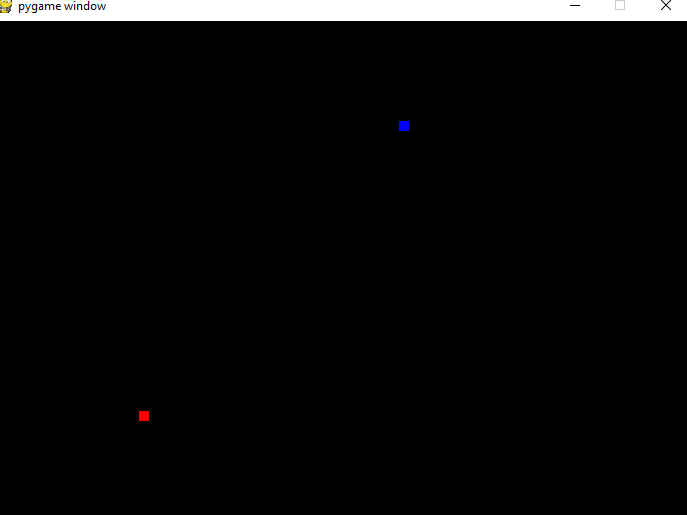

# AI-Snake-Game
This project is an AI that learns to play a snake game. I implemented this using a module "NEAT" in python, an evolutionary algorithm.
# Requirements
* Python 3.6 or below
* Pygame
* Neat
* Random
* Os
* Math
* Numpy
# Example

